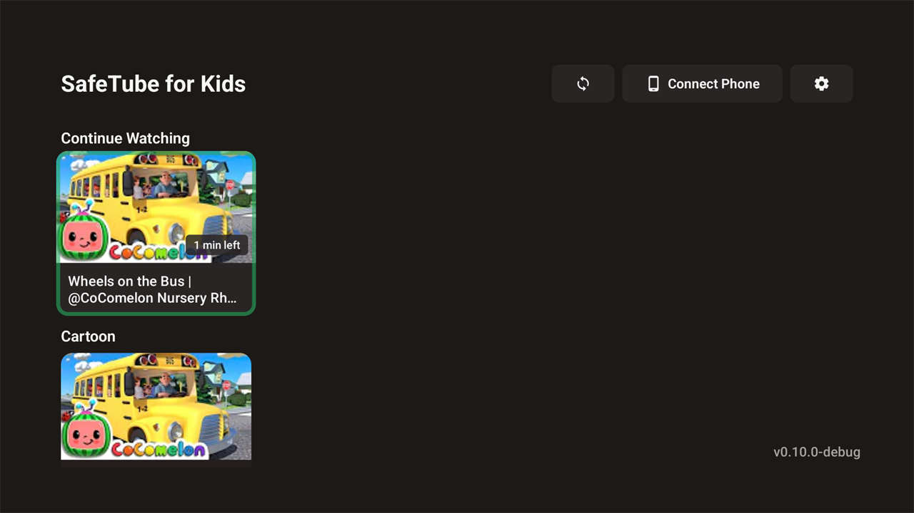
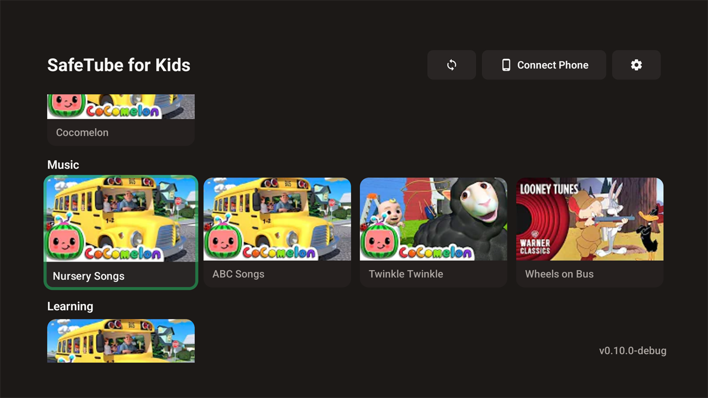
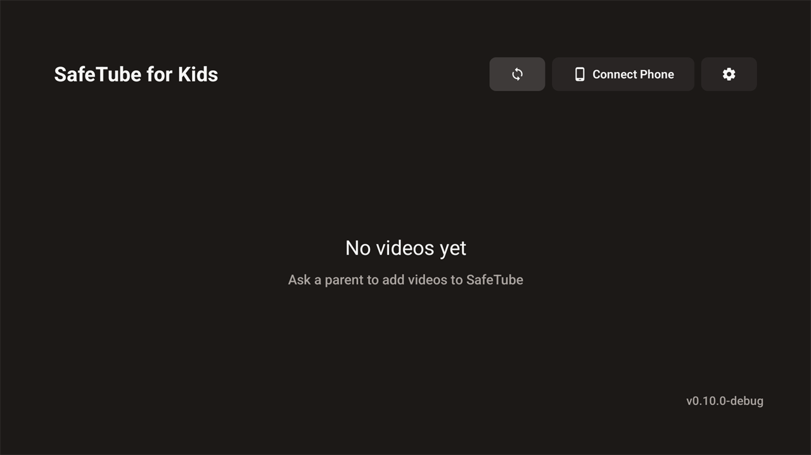

# SafeTube for Kids

A parent-controlled YouTube player for Android TV. Children see only the videos a parent has
approved — no search, no recommendations, no ads, no algorithm — and the videos they do see play
in a proper TV player built for a remote control.

> **Forked, and now substantially different.** SafeTube for Kids began as a fork of
> [ParentApproved.tv](https://github.com/Prasanna79/parentapproved) by Prasanna K. The approval
> model, the phone dashboard and the "approved content only" premise come from that project, and
> the upstream license is retained (see [LICENSE](LICENSE)). The playback experience, the
> security boundary and the test tooling have since been rebuilt here and no longer resemble the
> original.

**Developer:** Kapil Mahawar — Reddit: [KapilMahwar](https://www.reddit.com/user/KapilMahwar)

---

## What it does

- **Approved content only.** A parent adds YouTube videos, playlists or channels from their
  phone. The TV app can play *only* those. There is no search, no home feed, no "related
  videos", and no way to reach YouTube itself.
- **A real TV player.** Built on AndroidX Media3: play/pause, a timeline with position and
  duration, 10-second seeking on the remote, controls that auto-hide, a buffering indicator, and
  an error state with Retry/Back instead of a stack trace.
- **Subtitles, quality, audio language, speed and screen fit.** All reachable from the remote in
  a settings row (D-pad down). Subtitles are YouTube's own tracks; quality and audio list only
  what a video actually offers — including multiple audio *languages* (English, Hindi, Bangla, …)
  rather than bitrate variants.
- **Resume, without the wait.** Progress is remembered per video. Reopening a video starts playing it
  from the beginning *straight away* and offers to carry on from where the child left off: choosing
  Resume jumps to the saved position, and leaving the offer alone withdraws it and keeps playing from
  the start. A video watched to the end is not offered for resume.
- **Organised the way the parent wants.** The parent's configuration defines named shelves
  ("Cartoon", "Music", …) and what goes on each one — a whole YouTube playlist or a single video, in
  whatever order the parent chose — and the TV renders exactly that and nothing else. The shelves come
  from a catalog the TV keeps locally, so it still works with the server switched off. (The parent
  dashboard for editing the catalog is not built yet; today it is configured through the
  `PUT /catalog` API.)
- **Approved queue.** Next/previous and end-of-video autoplay only ever walk the parent-approved
  list, in the parent's order. When the list ends, playback stops.
- **Screen time.** Daily limits, bedtime, bonus minutes and a manual lock, managed from the
  phone. Pausing stops the clock.
- **Kiosk mode.** Optionally lock the TV to a whitelist of apps.

## Screenshots

Captured from the app running on a Xiaomi Mi Box 4 (1920×1080, Android TV 12).



*The TV home screen **is** the parent's catalog: one shelf per category the parent configured, in the
parent's order, using the parent's names (plus a Continue Watching shelf from the child's own
progress). It is drawn from the database on the TV, so the server can be switched off and the shelves
are still there.*



*A "Music" shelf holding two playlists ("Nursery Songs", "ABC Songs") and two single videos
("Twinkle Twinkle", "Wheels on Bus") in one row, in exactly the order the parent set. The app does
not sort them, group them or separate playlists from videos.*



*With nothing configured the child gets a plain, deliberate empty state — never a search box, a feed,
"related videos" or a YouTube suggestion.*

## Architecture

```
Phone (browser) ──HTTP/8080──▶ TV app: Ktor server + Room + Compose UI
                                      │
                                      ▼
 Kids UI ─▶ PlaybackController ─▶ PlaybackAuthorization ─▶ VideoResolver ─▶ Media3 ─▶ TV player
```

- **`PlaybackAuthorization`** is the single gate: a video plays only while it is in the approved
  cache and its parent source still exists. That cache is also the only queue the player may
  walk, so "next video" can never become a YouTube recommendation.
- **The catalog** is what the home screen draws. A parent's configuration is published to the TV's
  server as versioned JSON (`PUT /catalog`), the TV syncs it into Room, and the screen then reads
  *only* Room — so it never waits on the network. An unreachable, malformed or older server changes
  nothing, and a catalog replacement is one transaction, so the UI can never show half of one. Being
  in the catalog is not permission: it says what the parent *configured*, and
  `PlaybackAuthorization` still decides what may play.
- **`PlaybackController`** owns playback: authorization, queue position, play/pause, seeking,
  watch-time accounting, resume persistence and time-limit reactions. The UI holds no media state
  and never touches the player directly.
- **`VideoResolver`** turns an approved video id into playable renditions with NewPipeExtractor
  (no API key, no sign-in), preferring a DASH manifest for genuine multi-track playback and
  falling back to progressive streams.
- **The TV player UI** is Compose: Media3 renders video and subtitles with its own controller
  disabled, and every control on screen — timeline, menus, overlays — is drawn for TV viewing
  distance and driven by the D-pad or media keys.

## Building

Requires JDK 17 and the Android SDK (`compileSdk 36`).

```bash
cd tv-app
./gradlew assembleDebug
adb install -r app/build/outputs/apk/debug/app-debug.apk
```

## Testing on a real TV

The TV is part of the development loop, not a final demonstration. `tv-app/scripts/tv-e2e.ps1`
builds, installs, launches and drives the app **over ADB using remote keys only** — no touch, no
shortcuts — and asserts against the app's own log and status API:

```powershell
$env:ANDROID_HOME = "<android-sdk>"
./tv-app/scripts/tv-e2e.ps1 -Serial <tv-ip>:5555 -Adb "$env:ANDROID_HOME\platform-tools\adb.exe"
```

It covers D-pad navigation into an approved video, play/pause, seeking, the subtitle / quality /
speed / fit menus, resume and start-over, approved-queue next/previous, autoplay, end-of-video
behaviour, unapproved-video blocking, unauthenticated API access, deep-link injection and
crash/ANR detection. Each run writes `device.txt`, `commit.txt`, logs, screenshots and an API dump
to `test-results/tv/<timestamp>/`. Pass `-QualityProbe` to temporarily approve a multi-rendition
video and exercise quality/audio switching (removed again afterwards).

## Known limitations

- YouTube changes its internals regularly; extraction is only as current as the
  [NewPipeExtractor](https://github.com/TeamNewPipe/NewPipeExtractor) version pinned in
  `tv-app/app/build.gradle.kts`. Playlists once stopped resolving entirely because the pinned
  version predated YouTube's `lockupViewModel` playlist items — which is why that dependency is
  kept recent.
- Multi-track switching currently uses a seek-preserving stream reopen rather than Media3 track
  overrides, because every video tested so far exposes no DASH manifest.
- Remote access through a relay is inherited code pointed at upstream infrastructure and is not
  usable from this fork.

## License

Retained from the upstream project — see [LICENSE](LICENSE). This fork acknowledges
ParentApproved.tv by Prasanna K as its origin.
