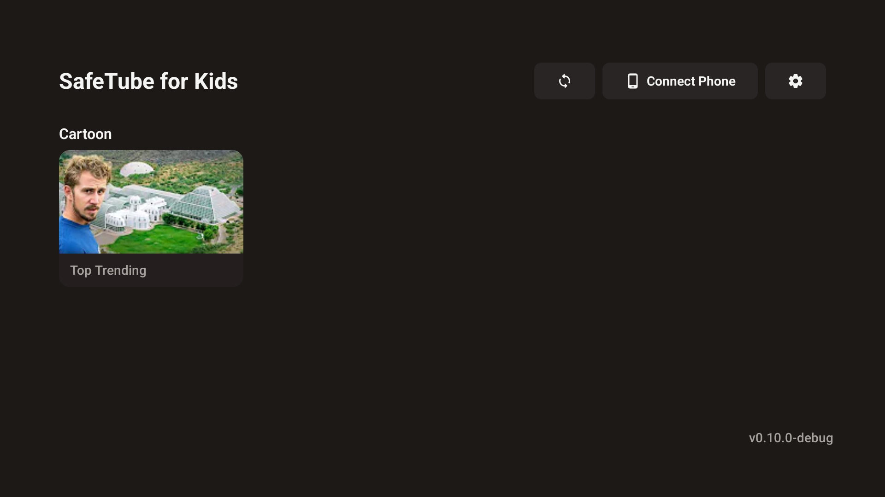
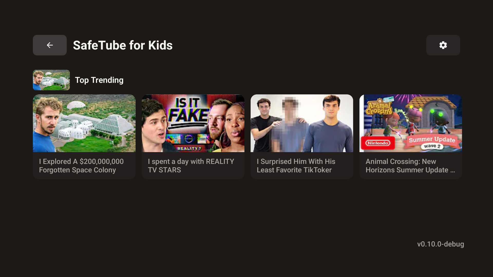
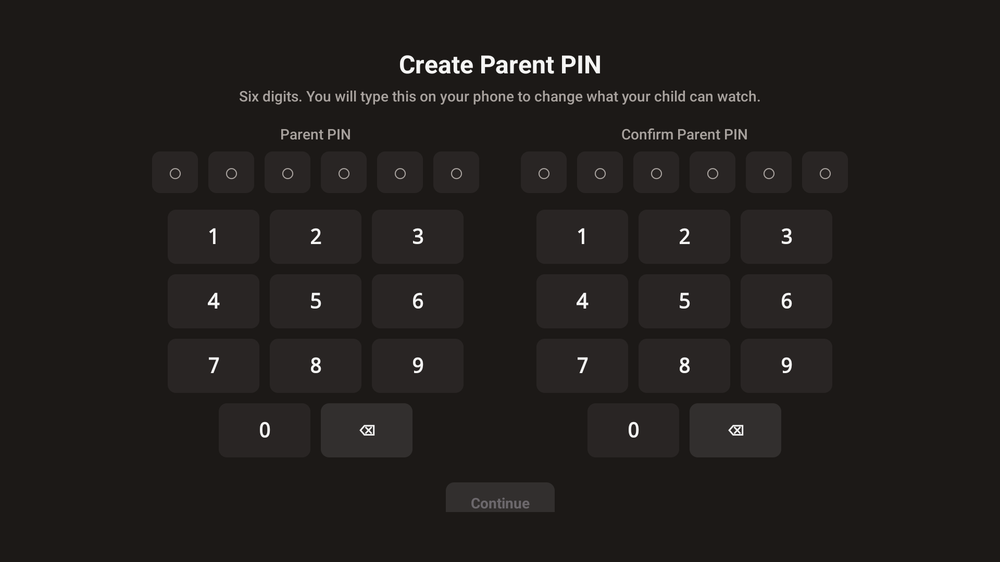
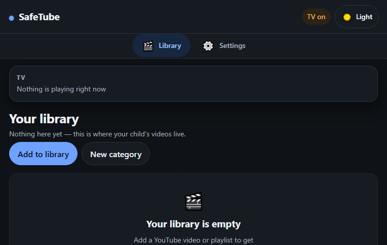
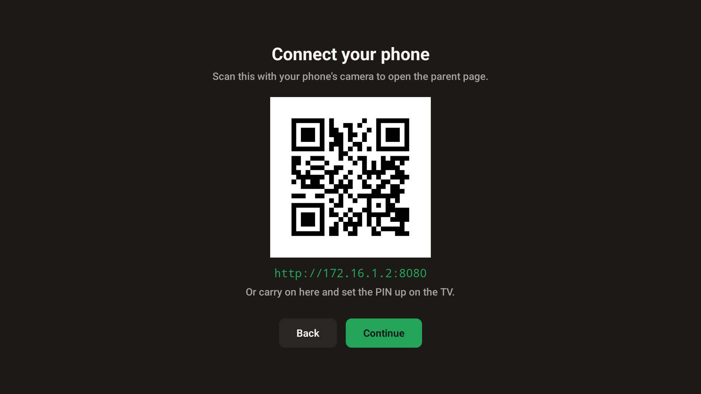
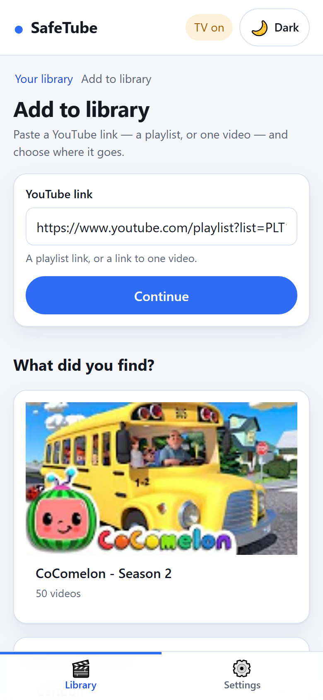
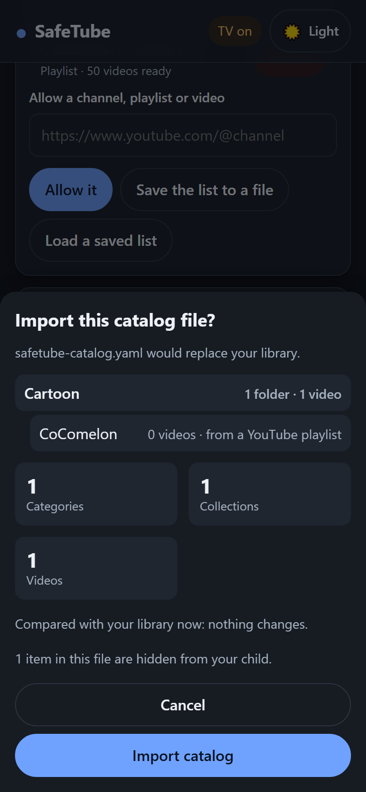
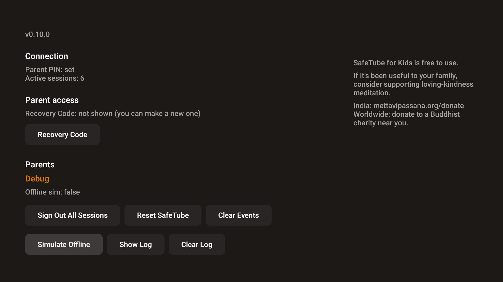
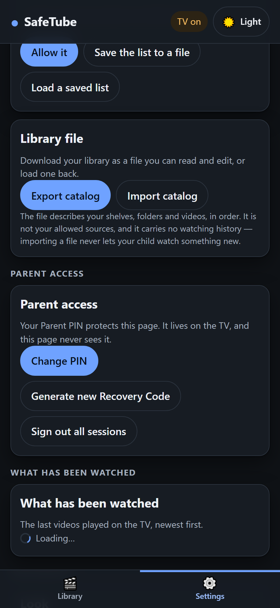

# SafeTube for Kids

> A parent-curated YouTube player for Android TV — only the videos and playlists you explicitly
> allow are available to your child.

SafeTube turns a television into a small, closed library. A parent chooses the content from their own
phone; the child sees those videos and nothing else. There is no search box, no home feed, no
"related videos" and no route back to YouTube itself — SafeTube is not an official YouTube product and
is not affiliated with YouTube.

**Developer:** Kapil Mahawar — Reddit: [KapilMahwar](https://www.reddit.com/user/KapilMahwar)

SafeTube for Kids began as a fork of [ParentApproved.tv](https://github.com/Prasanna79/parentapproved)
by Prasanna K. The approval model and the "approved content only" premise come from that project and
the upstream licence is retained (see [LICENSE](LICENSE)); the catalog, the parent dashboard, the
player, the security boundary and the test tooling have since been rebuilt here. See
[Origins](#origins-and-licence).

---

## Screenshots

All captured from the app running on a Xiaomi Mi Box 4 (Android TV 12, 1920×1080).

### The child's library



One row per category the parent created, in the parent's order, using the parent's names. A card is a
collection (a whole YouTube playlist brought in by the parent) or a single video. Nothing is
recommended, sorted or suggested.

### Inside a collection



Opening a collection shows the videos inside it — again in the parent's order, and only videos that
SafeTube is allowed to play.

### First-run setup, on the TV



A new installation opens on a short setup: welcome, connect a phone, create the Parent PIN, save the
Recovery Code, ready. The PIN is entered on the TV's own keypad.

### The parent dashboard



The parent's side of the product: a browser page served by the TV itself, over the local network. No
account, no cloud service, no app to install on the phone.

---

## What SafeTube is

SafeTube is an Android TV application with a browser dashboard for the parent.

- **The child watches** a library the parent curated: categories, the collections and videos inside
  them, and a Continue Watching row built from the child's own progress. That is the whole interface.
- **The parent configures** it from any phone, tablet or computer on the same network, by opening the
  address the TV shows. The TV serves that page itself.
- **Everything is local.** The library lives on the TV, the dashboard is served by the TV, and there is
  no SafeTube account or backend to sign in to. YouTube is used only as the source of video streams.

### Two things that are deliberately separate

This distinction is the heart of the design, and the code enforces it:

| | What it means |
|---|---|
| **Catalog** (the library) | What the child *sees* in SafeTube. The parent's configuration: categories, collections, videos, their order, and what is hidden. |
| **PlaybackAuthorization** | What the child is *allowed to play*. It reads only the approved sources the TV has cached, and it decides every playback. |

Putting a video in the library does not grant permission to play it, and nothing in the library can
change what is authorized. A catalog entry for a video that is not covered by an approved source still
appears in the library — the dashboard marks it **Can't play yet** — but pressing it on the TV plays
nothing. The reverse is also true: approving a source does not add anything to the child's library —
the parent still decides what the child sees.

---

## Key features

### For the child (Android TV)

- D-pad-first interface built for a television: one row per category, cards you can read from the sofa
- Parent-curated library only — no search, no feed, no recommendations, no ads
- Collections (whole playlists) and individual videos, mixed in the same row where the parent put them
- Video player with play/pause, a timeline, 10-second seeking, subtitles/CC, video quality, audio
  language, playback speed and screen fit, all reachable from the remote
- Resume: progress is remembered per video, and SafeTube offers to continue where the child left off
- Approved queue: next/previous and end-of-video autoplay walk only the parent's list, in the parent's
  order, and stop at the end
- Continue Watching, built from the child's own progress on this TV
- Screen time: daily limits, bedtime, bonus minutes and a manual lock
- Focus is remembered when returning from the player or a collection

### For the parent (browser dashboard)

- Add content by pasting a YouTube video or playlist link, with a preview before anything is added
- Organise it: categories, collections, renaming, reordering, hiding items, and moving content between
  containers
- Approve the YouTube sources (channel, playlist or single video) that may be played at all
- See what the TV is doing: connection state, library version, and a live Now Playing card
- Time limits and bonus minutes
- Library as a file: export the whole catalog to YAML and import one back
- Parent access: change the Parent PIN, issue a new Recovery Code, sign out every session

### Parent access

- A **Parent PIN** the parent chooses during first-run setup, on the TV
- It survives app restarts and TV reboots — it is a durable credential, not a per-session code
- Stored as a salted, slow-hash verifier: SafeTube never keeps the PIN itself, and never displays it
- Signing in exchanges the PIN for a temporary dashboard session; the PIN is not used as a token
- Failed attempts are rate-limited, with a cooldown that grows each time
- A **Recovery Code** shown once during setup, for a forgotten PIN; using it replaces the PIN and
  rotates the code
- A **last-resort reset on the TV** for a parent who has lost both, requiring a typed confirmation
  phrase and a second confirmation

---

## Security model

SafeTube is designed and tested so that catalog entries do not themselves grant playback permission,
and so that external attempts — deep links, intents, the API — are not accepted as an unrestricted
playback path. It makes no claim beyond that: this is a family product, not a hardened appliance.

```text
Parent adds a YouTube link to the library
                │
                ▼
        Catalog entry exists            ← what the child sees
                │
                ▼
        Child selects the item
                │
                ▼
   PlaybackAuthorization checks it      ← what may actually play
                │
        ┌───────┴────────┐
        ▼                ▼
     Allowed           Denied
   (playback)     (refused, with an explanation on screen)
```

- **One gate for playback.** Every playback path goes through the same authorization check, which reads
  only the approved sources cached on the TV. If the source is gone, or the video was never approved,
  nothing plays.
- **No route around it.** The player's queue is the approved list; next/previous and autoplay can only
  walk it. A deep link or an intent that names a video SafeTube has not been allowed to play is
  refused, and there is no API that starts playback without a dashboard session.
- **No browsing experience.** SafeTube has no search field, no channel browser and no recommendations.
  The only YouTube content it can reach is what an approved source already contains.
- **The dashboard is authenticated.** Every configuration endpoint requires a session issued from the
  Parent PIN; the only public endpoints report whether the TV is reachable and whether a PIN exists.
- **The reset is destructive on purpose.** A parent who has lost both the PIN and the Recovery Code can
  recover only by erasing SafeTube's own state on the TV — there is no shortcut, and no secret that
  would let a stranger take it over.

---

## How it works

```text
              Parent phone / browser
                        │
                        │  local network (http://<tv-ip>:8080)
                        ▼
        ┌───────────────────────────────────┐
        │            Android TV             │
        │                                   │
        │   Ktor server ── parent dashboard │
        │        │                │         │
        │        │         catalog document │  ← files/catalog.json
        │        ▼                │         │
        │   Room database ◀───────┘         │  ← TV's own copy of the library
        │        │                          │
        │        ▼                          │
        │   Compose TV interface            │
        │        │                          │
        │        ▼                          │
        │   PlaybackAuthorization           │  ← reads approved sources only
        │        │                          │
        │        ▼                          │
        │   Media3 player ◀── NewPipe       │  ← YouTube streams, no API key
        └───────────────────────────────────┘
```

- **The TV hosts everything.** The parent dashboard, the API and the library all live on the TV; the
  phone is only a browser. No SafeTube traffic leaves the network.
- **Two stores, one direction.** The server keeps the parent's document
  (`files/catalog.json`, versioned); the TV keeps its own copy of the library in a database. The TV
  reads its local copy to draw the screen, so it never waits on the network, and it picks up changes
  from the server by synchronising — on start, every 15 minutes, or immediately when the parent asks.
- **A replacement is one write.** Publishing the library is a single atomic, version-checked document
  write, so the child's screen can never show half an edit, and a stale or conflicting change is
  refused rather than merged.
- **The player never talks to YouTube for recommendations.** It resolves the exact video it was given.

---

## Requirements

| | |
|---|---|
| Device | An Android TV device or TV box. Reference device: **Xiaomi Mi Box 4** (Android TV 12), other Android TV devices are expected to work but are not verified |
| Android version | `minSdk 24` (Android 7.0) or newer; built against `compileSdk 36`, `targetSdk 34` |
| Network | The TV and the parent's phone must be on the same local network; the TV needs internet access for YouTube playback |
| Parent device | Any phone, tablet or computer with a web browser on the same network |
| Storage | Enough free space for the app and its cached thumbnails |

Verified on: **Mi Box 4, Android 12, 1920×1080**.

## Install

There is **no public release channel** yet — no Play Store listing and no published APK download.
SafeTube is currently installed from a locally built debug APK. Release signing requires a keystore
that is not part of this repository (see [Development](#development)), so a signed release build cannot
be produced from a fresh clone.

```bash
# build the debug APK
cd tv-app
./gradlew assembleDebug

# install it on the TV
adb connect <tv-ip>:5555        # if your TV is not already connected
adb install -r app/build/outputs/apk/debug/app-debug.apk
```

On first launch the app runs its setup (below). `versionName` is currently `0.10.0` (`versionCode 16`).

---

## First-time setup

A TV with no Parent PIN opens on a short setup flow and only ever shows it once:

```text
Install / first launch
        ↓
Welcome to SafeTube
        ↓
Connect your phone          ← QR code + the TV's address
        ↓
Create Parent PIN           ← six digits, typed on the TV's keypad
        ↓
Save the Recovery Code      ← shown once; write it down
        ↓
SafeTube is ready           → the child's library
```

- **The Parent PIN is created on the TV**, not in the browser. Six digits, entered twice, on the TV's
  own keypad.
- **The QR code contains only the dashboard address.** It is a convenience for opening the parent page
  on a phone; it is not a credential and does not contain the PIN.
- **The Recovery Code is shown once** and cannot be displayed again — SafeTube stores only a verifier
  for it. Write it down and keep it somewhere other than the TV. If it is lost, and the PIN is
  forgotten too, the only way back in is the destructive reset described below.

An installation that already has a library and approved sources but no persistent PIN (an older
SafeTube) simply runs this setup once and keeps everything else — the library, the sources and the
watch history are not touched by creating a credential.

## Connecting a phone or browser

1. On the TV's home screen, choose **Connect Phone**.
2. Scan the QR code with a phone camera, or type the address that is shown (`http://<tv-ip>:8080`).
3. The page asks for the **Parent PIN**. Enter it and you are signed in.



The same screen during first-run setup. The QR code is the dashboard address; the PIN is never part of
it.

- The dashboard address is the TV's own address on your network — it changes if the TV's address
  changes, in which case read it off the TV again.
- Signing in creates a session that lasts up to 90 days on that browser. You are not asked for the PIN
  on every action.
- Signing out is available in **Settings → Parent access → Sign out all sessions**, which ends every
  session everywhere.

## Adding content

There are two different things a parent adds, and the dashboard keeps them separate.

```text
Parent dashboard
      │
      ├─ Allowed sources  ── may this YouTube source be played at all?
      │      Settings → Content → Allowed YouTube sources
      │      (a channel, a playlist or a single video)
      │
      └─ The library      ── what will my child see?
             Library → Add to library
             (a playlist, or a single video)
```

**To add something to the library**, open the dashboard, choose **Add to library**, pick where it goes,
paste a YouTube link, and check the preview — SafeTube resolves the link and shows what it found
before anything is added. Then add it.



- A **playlist** becomes a collection: a card in a category that opens to show its videos.
- A **single video** becomes one card, and plays directly.
- A **channel** cannot be added to the library. A channel is a *source*, not a container, so SafeTube
  says so and points at Settings instead of accepting a link it would have to ignore.

Once the parent has approved the source a video comes from, the video plays. Until then the dashboard
marks it **Can't play yet** and the TV refuses it — the library and permission are separate on purpose
(see [Security model](#security-model)).

## Organising the library

Categories hold collections and videos; collections hold videos. That is the whole hierarchy, and the
order is always the parent's.

```text
Cartoon                     ← a category: a row on the TV
├── CoComelon               ← a collection (a playlist)
│   ├── Wheels on the Bus
│   ├── Bath Song
│   └── …
├── Bedtime Songs           ← a collection
│   └── …
└── A single video          ← one video, directly in the category
```

- **Categories** are headings and containers, not playable items. They can be renamed, reordered and
  hidden, and a category with nothing in it is simply empty.
- **Collections** are brought in from a playlist, or built by hand and filled with individual videos.
- **Items** can be renamed, reordered (arrows on the row, or the item menu: up, down, top, bottom),
  moved to another category or collection, hidden from the child without deleting them, or removed.
- **Pictures:** a collection's card can show a still chosen from the videos inside it; otherwise
  SafeTube picks one from the playlist itself.
- **Hiding** is what "not now" means: the item stays in the library, the child does not see it.
- Removing something tells you exactly what goes with it — including how many videos a collection holds
  — before you confirm.

The child's screen follows this structure exactly: one row per category, cards for whatever is inside,
and the parent's order throughout.

## The library as a file (YAML)

The whole library can be written out as one readable YAML file and loaded back — for backup, for
editing by hand, and for moving a curated library between TVs.



**Settings → Content → Library file** offers **Export catalog** and **Import catalog**.

```yaml
version: 1

catalog:
  name: SafeTube Library
  categories:
    - id: cat-cartoon
      name: Cartoon
      order: 0
      collections:
        - id: col-songs
          name: Nursery Songs
          order: 0
          playlist: PLxxxxxxxxxxxxxxxxxxxxxx
          videos:
            - id: col-songs#dQw4w9WgXcQ
              youtube: dQw4w9WgXcQ
              title: A song
              order: 0
      videos:
        - id: vid-one
          youtube: dQw4w9WgXcQ
          title: A single video
          order: 0
          hidden: true
```

- **Exporting** writes the library — categories, collections, videos, their order and what is hidden —
  and nothing else. It reads only: the TV is not touched.
- **Importing** validates the whole file first. Anything it does not understand is refused with a line
  number and a reason, and nothing is changed.
- A valid file is **previewed before it is applied**: what is in the file, what would change, and
  whether any of its videos come from sources that are not allowed (those will not play).
- Importing replaces the library in one write at the version the page read, so a failure or a conflict
  leaves the previous library exactly as it was.
- A round trip is stable: exporting, importing and exporting again produces the same file.
- **The file carries no permission.** Allowed sources are not in it, and importing one cannot make
  anything playable that was not allowed already.

The format, its rules and its refusals are documented in
[`docs/W9_YAML_CATALOG.md`](docs/W9_YAML_CATALOG.md).

---

## Parent PIN and recovery

### Changing the PIN

**Settings → Parent access → Change PIN.** You are asked for the current PIN, the new PIN, and the new
PIN again. On success every signed-in browser is signed out, including the one you are using, and you
sign in again with the new one. The library, the approved sources and the Recovery Code are untouched.

### Forgot the PIN

On the sign-in page choose **Forgot PIN?**

1. Enter the **Recovery Code** that was shown during setup and verify it.
2. Create a new Parent PIN (six digits, twice).

The new PIN works immediately, every previous session is signed out, and the Recovery Code you used
stops working — a fresh one is shown, once, to be written down. If you still know the PIN and only want
a new Recovery Code, **Settings → Parent access → Generate new Recovery Code** issues one and retires
the old.

### Forgot both the PIN and the Recovery Code

The only way back in is a **destructive reset, performed on the TV** — there is no dashboard button for
it and no API for it, because a remote request must not be able to erase a child's library.



**Settings → Reset SafeTube** on the TV. It asks you to type the phrase it displays
(`I UNDERSTAND THIS ERASES EVERYTHING`) and then asks a second, separate question. Only after that
second confirmation does anything happen.

What the reset erases — everything SafeTube owns, and nothing else:

| Erased | Kept |
|---|---|
| The Parent PIN and the Recovery Code | Android itself, its settings and the other apps on the TV |
| Every dashboard session | SafeTube's own app installation |
| The curated library and the TV's copy of it | Anything outside SafeTube's private storage |
| Approved sources and their cached videos | |
| Watch history and resume positions | |
| Time limits, bedtime and bonus minutes | |
| Kiosk configuration and app whitelist | |
| Remote-access configuration and the crash log | |

Afterwards the TV behaves like a new installation: it opens on first-run setup, and the dashboard has
nothing to sign in to until a new Parent PIN is created on the TV.

---

## The child's experience

The child gets the library and the player. Nothing else.

- The home screen is one row per category, plus a **Continue Watching** row when there is progress to
  resume. Cards are read from the sofa and driven entirely by the remote.
- Opening a collection shows its videos. Back returns to the row the child came from, with focus where
  they left it.
- Anything the parent **hid** is simply not there. A card whose YouTube source is not allowed is there
  — the parent put it in the library — and pressing it says plainly that it can't be played, because
  the player refuses before it resolves anything.
- With nothing configured, the screen says so plainly — never a search box, a feed or a suggestion.
- Screen-time limits and a manual lock are enforced here too, with a calm lock screen rather than an
  error.

## The video player

Built on AndroidX Media3, rendered for television viewing distance and driven by the remote.

| | |
|---|---|
| Playback | Play/pause, a timeline with position and duration, buffering indication, and an error state offering Retry or Back |
| Seeking | 10 seconds forward and back from the remote |
| Subtitles | YouTube's own caption tracks, switchable from the player menu |
| Video quality | The renditions the video actually offers, switchable with playback preserved |
| Audio | Multiple audio *languages* where the video provides them (English, Hindi, Bangla, …) |
| Speed and fit | Playback speed, and aspect/fit options for older 4:3 content |
| Resume | Per-video progress; reopening offers to continue from where the child stopped |
| Queue | Next and previous within the parent's list, and continuing automatically into the next approved video when one ends; at the end of the list, playback stops |
| Remote | Media keys and D-pad; controls auto-hide, and opening the menu does not disturb playback |

## The parent dashboard

The dashboard is a single page with two sections — **Library** and **Settings** — and is built for a
phone first.

| Section | What is there |
|---|---|
| **Library** | The categories and their contents, add/organise/edit, the live Now Playing card, and the TV's connection state |
| **Settings → TV** | *Your TV*: what the television is doing right now — its version and connection state, remote play/pause and next, and "Update the TV now" |
| **Settings → Time limits** | *Screen time*: daily limits, bedtime, bonus minutes and the manual lock |
| **Settings → Content** | *Allowed YouTube sources*, and *Library file* (export/import the catalog as YAML) |
| **Settings → Parent access** | Change PIN, generate a new Recovery Code, sign out all sessions |
| **Settings → What has been watched** | Today's totals, and the recent videos behind the child's Continue Watching row |
| **Settings → Appearance** | *Look*: light or dark, remembered on this phone |
| **Settings → Troubleshooting** | *Your library* (what the TV holds, with "Update the TV now", "Check for problems" and "Reload the library") and *Something wrong?* (the error report) |



Everything the dashboard shows about the TV comes from the TV itself, and every change is written at
the version the page read — so two devices editing at once produce a conflict you are told about,
rather than a silent overwrite.

---

## Data and privacy

- **Everything is local.** The library, the settings, the watch history and the Parent PIN live in the
  TV app's private storage. There is no SafeTube account, no SafeTube cloud service and no analytics.
- **The dashboard is served by the TV.** It is reachable from your network, and only while the TV's
  server is running.
- **The Parent PIN and the Recovery Code are not stored in readable form.** SafeTube keeps salted
  verifiers for both, never the values themselves, and never shows them again after they are set.
- **Credentials are not logged.** The PIN and Recovery Code are never written to the app's log and are
  not exposed through the normal API; the only way to set a known credential is a debug-build testing
  instrument described in the developer documentation.
- **YouTube is an external service.** Playback fetches the video from YouTube, so YouTube sees the
  request as it would from any player. SafeTube adds no tracking of its own, and it is not an official
  YouTube client.
- **Remote access is off by default** and is inherited upstream code pointing at infrastructure this
  fork does not run (see [Known limitations](#known-limitations)).

## Development

| | |
|---|---|
| Language / stack | Kotlin, Jetpack Compose, AndroidX Media3 (ExoPlayer), Room, an embedded Ktor (Netty) server |
| Module | `:app` (single module), package `tv.safetubeforkids.app`, `versionName 0.10.0` |
| SDKs | `minSdk 24`, `targetSdk 34`, `compileSdk 36` |
| Build | JDK 17 and the Android SDK |

```bash
# build
cd tv-app && ./gradlew assembleDebug

# unit tests (JVM) and the dashboard's JavaScript suites
cd tv-app && ./gradlew test assembleDebug
cd tv-app && node --test scripts/dashboard-*.test.js
```

Two things worth knowing before changing anything:

- **`PlaybackAuthorization` is the authorization boundary.** The catalog is configuration; nothing in
  it may grant playback.
- **The dashboard JavaScript has no build step.** It is hand-written and served straight from
  `tv-app/app/src/main/assets/`, checked by `node --test` and by `node --check` in CI.

### Testing on a real TV

The TV is part of the development loop, not a final demonstration.
`tv-app/scripts/tv-e2e.ps1` installs the app, launches it and drives it **over ADB with remote keys
only** — no touch, no shortcuts — asserting against the app's own log and status API:

```powershell
$env:ANDROID_HOME = "<android-sdk>"
cd tv-app
./scripts/tv-e2e.ps1 -Tier player -SkipBuild     # playback and navigation
./scripts/tv-e2e.ps1 -Tier full   -SkipBuild     # the above plus authorization and deep-link checks
```

Each run writes logs, screenshots, an API dump and a machine-readable result to
`test-results/tv/<timestamp>/`. Pass `-QualityProbe` to also exercise quality and audio switching
against a multi-rendition video. A run needs a reachable Parent PIN; the harness installs one it knows
through a debug-build instrument rather than reading a credential out of the app.

## Testing and project status

The project has been developed through a sequence of milestones (W7 dashboard and security, W8 and W8.2
usability work, W9 the catalog file, W10 parent access), and each one was verified on the real device
rather than only in unit tests.

Current milestone — **W10-STABLE-2026-09-28** (`421acc9`):

| Check | Result |
|---|---|
| JVM unit tests, debug | 910 / 910 |
| JVM unit tests, release | 910 / 910 |
| Dashboard JavaScript suites | 211 / 211 |
| Device harness, PLAYER tier | 41 / 41 |
| Device harness, FULL tier | 53 / 53, final pass |
| Real-device W10 flow (Mi Box 4, Android 12) | First-run setup, QR, PIN sign-in, restart persistence, PIN change, recovery, Recovery Code rotation, destructive reset and wipe |

Two honest notes about the numbers above:

- **A signed release APK is not built in this environment.** `assembleRelease` stops at
  `validateSigningRelease` because the release keystore is not in the repository (by design). The
  release *unit tests* above do run, and the debug APK is signed with the standard debug key.
- The device harness skips its quality/audio probe unless `-QualityProbe` is passed, because it needs a
  video with several renditions.

## Project status

```text
Current stable milestone: W10
Stable tag:               W10-STABLE-2026-09-28
Commit:                   421acc9
Previous milestones:      W9-STABLE-2026-09-27 (b12f884), W8-STABLE-2026-09-27 (06b79d0)
```

W10 adds persistent parent access with a Parent PIN, a Recovery Code, authenticated dashboard sessions
and TV-only destructive recovery, while preserving the existing curated catalog and playback
authorization model.

## Documentation

Written for the people (and agents) who work on this project:

- [`docs/W10_PARENT_ACCESS.md`](docs/W10_PARENT_ACCESS.md) — the Parent PIN, the Recovery Code, the
  reset, and what the real device taught us about each
- [`docs/W9_YAML_CATALOG.md`](docs/W9_YAML_CATALOG.md) — the catalog file: format, refusals, round trip
- [`docs/SECURITY_MODEL.md`](docs/SECURITY_MODEL.md) — the authorization boundary and what must not be
  weakened
- [`docs/ARCHITECTURE.md`](docs/ARCHITECTURE.md) — the architecture, with class names
- [`docs/TESTING.md`](docs/TESTING.md) — how to run everything, and what is actually green
- [`docs/W8_UX_AUDIT.md`](docs/W8_UX_AUDIT.md),
  [`docs/W8_2_UX_AUDIT.md`](docs/W8_2_UX_AUDIT.md) — the usability audits behind the current dashboard
- [`docs/W7_IMPLEMENTATION_REPORT.md`](docs/W7_IMPLEMENTATION_REPORT.md),
  [`docs/W8_IMPLEMENTATION_REPORT.md`](docs/W8_IMPLEMENTATION_REPORT.md),
  [`docs/W8_2_IMPLEMENTATION_REPORT.md`](docs/W8_2_IMPLEMENTATION_REPORT.md) — what each milestone built
- [`docs/PROJECT_CONTEXT.md`](docs/PROJECT_CONTEXT.md), [`AI_CONTEXT.md`](AI_CONTEXT.md),
  [`HANDOVER.md`](HANDOVER.md), [`docs/PHASES/`](docs/PHASES/) — the phase-era handoff documents, useful
  for history and device pitfalls, but written before W7–W10 and no longer describing the current
  dashboard or parent access
- [`docs/screenshots/`](docs/screenshots/) — the screenshots used here, and the audit captures behind them

## Origins and licence

SafeTube for Kids is a fork of [ParentApproved.tv](https://github.com/Prasanna79/parentapproved) by
Prasanna K, whose root commit is this repository's root commit. The approval model, the "approved
content only" premise and parts of the phone dashboard come from that project, and its licence is
retained unchanged — see [LICENSE](LICENSE).

Since the fork, the catalog (a versioned tree with its own editor and a YAML file format), the parent
dashboard, the parent-access model, the TV interface, the player and the verification tooling have been
rebuilt here. The upstream project does **not** contain the W8–W10 functionality described in this
README.

## Known limitations

- **Extraction depends on YouTube.** Videos and playlists are resolved with
  [NewPipeExtractor](https://github.com/TeamNewPipe/NewPipeExtractor) (no API key, no sign-in), so a
  YouTube change can break resolution until the pinned version is updated. When that happens the
  dashboard says what went wrong instead of failing silently.
- **Multi-track switching reopens the stream** while preserving position, rather than using Media3
  track overrides, because the videos tested so far expose no DASH manifest.
- **The relay is inherited and unusable.** Remote access points at upstream infrastructure this fork
  does not run; on-network access to the dashboard is what works. It is off by default.
- **One device, one family.** SafeTube has no notion of multiple child profiles; the library, the
  limits and the PIN belong to the TV.
- **Kiosk mode is not parent-facing.** Locking the TV to a whitelist of apps still exists in the app
  and in its API, but the dashboard does not offer it, so it is not part of the flow described here.
- **Only Android TV is verified.** The app requires a D-pad and a large screen; phones are for the
  dashboard.
